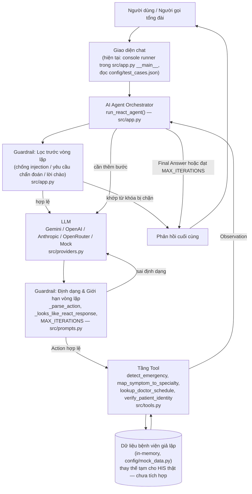
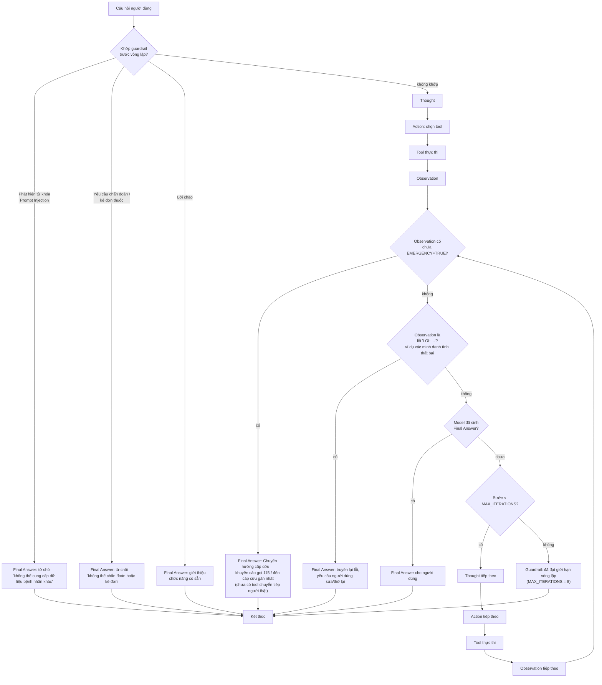
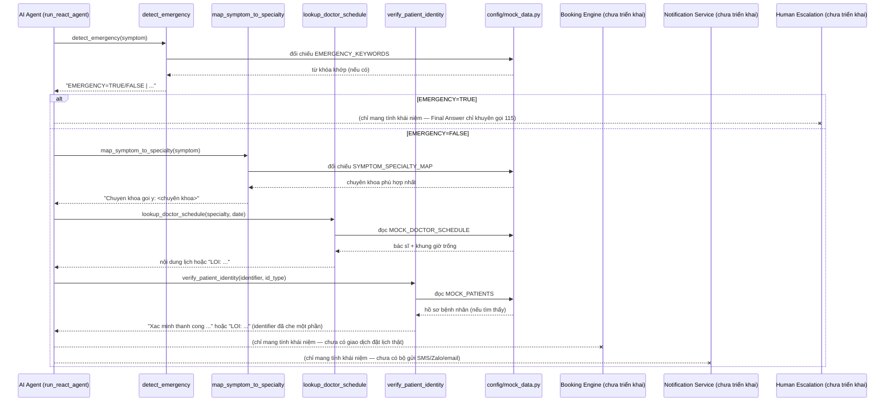

# 🏥 AI Agent Tư Vấn Chuyên Khoa & Đặt Lịch Khám Bệnh

Dự án lab minh họa kiến trúc ReAct Agent: người gọi tổng đài mô tả triệu chứng bằng tiếng Việt tự nhiên, agent sàng lọc dấu hiệu cấp cứu, gợi ý đúng chuyên khoa, tra cứu lịch bác sĩ thật và xác minh danh tính bệnh nhân — được xây dựng song song với một chatbot nền (không dùng tool) để chứng minh vì sao bài toán này cần Agent chứ không chỉ LLM thuần túy.

---

## 📋 Tổng quan dự án 

### Vấn đề cần giải quyết 

Bệnh nhân gọi tổng đài bệnh viện thường không biết nên khám khoa nào phù hợp với triệu chứng, mô tả triệu chứng mơ hồ, và đôi khi mô tả một tình huống cấp cứu thực sự mà không nhận ra. Một chatbot LLM thuần túy chỉ có thể trả lời từ kiến thức tĩnh đã học — không thể tra cứu lịch bác sĩ thật, không thể xác minh hồ sơ bệnh nhân thật, và không có cơ chế cứng nào đảm bảo không bao giờ bỏ sót dấu hiệu cấp cứu. Dự án này xây dựng và đánh giá một ReAct Agent giải quyết vấn đề đó bằng các lệnh gọi tool thực sự thay vì sinh văn bản tự do.

### Mục tiêu sản phẩm 

Đưa mỗi người gọi đi từ "tôi có triệu chứng này" đến "đây là chuyên khoa, bác sĩ và khung giờ trống bạn cần, và đây là thông tin tôi cần để xác minh danh tính" một cách an toàn, có căn cứ từ tool thật — đồng thời đảm bảo các tín hiệu cấp cứu, yêu cầu chẩn đoán/kê đơn, và yêu cầu truy cập dữ liệu bệnh nhân khác luôn bị chặn bằng luật cứng, không phụ thuộc vào "phán đoán" của LLM.

### Đối tượng người dùng 

- **Bệnh nhân/người gọi** mô tả triệu chứng bằng tiếng Việt tự nhiên, có thể mơ hồ, lo lắng, hoặc không nhận ra triệu chứng của mình là khẩn cấp.
- **Người gọi đặt hộ cho người thân** (ví dụ phụ huynh gọi đặt lịch cho con).
- **Bộ phận vận hành bệnh viện / người đánh giá bài lab** xem xét hành vi gọi tool, độ phủ guardrail và trace log của agent (xem `docs/trace_eval.md`).

---

## 🏗️ Kiến trúc dự án 

### 1. Sơ đồ kiến trúc tổng thể



### 2. Luồng thực thi ReAct



### 3. Sơ đồ tương tác với Tool



---

## 🧠 Quy trình làm việc của AI Agent (AI Agent Workflow)

Agent tuân theo vòng lặp `Thought → Action → Observation` nghiêm ngặt (`REACT_SYSTEM_PROMPT` trong `src/prompts.py`, được `run_react_agent` trong `src/app.py` thực thi), giới hạn tối đa `MAX_ITERATIONS = 8` bước:

```
Thought: Cần kiểm tra dấu hiệu cấp cứu trước.
Action: detect_emergency["đau bụng âm ỉ 3 ngày, buồn nôn"]
Observation: EMERGENCY=FALSE | Chưa phát hiện dấu hiệu cấp cứu trong mô tả.

Thought: Không phải cấp cứu, cần gợi ý chuyên khoa.
Action: map_symptom_to_specialty["đau bụng âm ỉ 3 ngày, buồn nôn"]
Observation: Chuyen khoa goi y: Tiêu hóa. Ly do: dau da day, buon non...

Thought: Đã có chuyên khoa, cần tra lịch.
Action: lookup_doctor_schedule["Tiêu hóa", "29/07/2026"]
Observation: Khoa Tiêu hóa ngày 29/07/2026: BS. Bùi Đức Long: 08:00, 09:30, 14:00...

Thought: Cần xác minh danh tính trước khi chốt lịch.
Action: verify_patient_identity["0912345678", "phone"]
Observation: Xac minh thanh cong. Benh nhan: Nguyen Van An (ma BN: BN-1023). PHONE ******5678.

Thought: Đã có đủ thông tin để trả lời.
Final Answer: Bạn phù hợp với khoa Tiêu hóa, BS. Bùi Đức Long còn slot 08:00/09:30/14:00
ngày 29/07/2026. Danh tính đã xác minh — vui lòng chọn giờ để hoàn tất.
```

Hai cơ chế an toàn bao quanh vòng lặp này, đều được orchestrator thực thi bằng luật cứng (không phải nhờ LLM "tự giác"):

- **Guardrail cứng trước vòng lặp** trong `run_react_agent` quét câu hỏi gốc để tìm từ khóa prompt-injection/yêu cầu dữ liệu bệnh nhân khác, yêu cầu chẩn đoán/kê đơn, và lời chào *trước khi* vòng lặp bắt đầu — nếu khớp, trả về ngay một `Final Answer` dựng sẵn, không gọi LLM hay tool nào cả.
- **Tính xác định khi fallback**: khi chạy với `LLM_PROVIDER=mock` (mặc định, không cần API key) hoặc khi output của provider thật không giống một bước ReAct hợp lệ, `_build_fallback_step` sẽ sinh `Thought`/`Action`/`Final Answer` tiếp theo một cách xác định từ các observation đã có, đảm bảo `config/test_cases.json` luôn cho ra trace có thể lặp lại được.

---

## 🛠️ Danh sách Tool hiện có

| Tool | Trách nhiệm |
|---|---|
| `detect_emergency(symptom)` | Sàng lọc từ khóa xác định (deterministic) đối chiếu `EMERGENCY_KEYWORDS`; luôn là lệnh gọi bắt buộc đầu tiên mỗi khi có mô tả triệu chứng. Trả về `EMERGENCY=TRUE/FALSE` kèm từ khóa khớp. |
| `map_symptom_to_specialty(symptom)` | Đối chiếu mô tả với `SYMPTOM_SPECIALTY_MAP` và trả về chuyên khoa có nhiều từ khóa khớp nhất, chỉ sau khi đã loại trừ cấp cứu. Không bao giờ tự bịa ra chuyên khoa ngoài danh sách đã duyệt. |
| `lookup_doctor_schedule(specialty, date)` | Đọc `MOCK_DOCTOR_SCHEDULE` theo chuyên khoa/ngày, chuẩn hóa định dạng ngày (`dd/mm/yyyy` hoặc `yyyy-mm-dd`), trả về tên bác sĩ thật + khung giờ trống hoặc lỗi `LOI:` nếu sai chuyên khoa/ngày. |
| `verify_patient_identity(identifier, id_type)` | Xác thực định dạng identifier (chỉ `phone`, `cccd`, hoặc `bhyt`) bằng regex, tra cứu bệnh nhân trong `MOCK_PATIENTS`, và che toàn bộ identifier trừ 4 ký tự cuối trong phản hồi. |


---

## 🛡️ Guardrails

| Guardrail | Cơ chế | Được thực thi tại |
|---|---|---|
| **Emergency override** | `detect_emergency` luôn là tool bắt buộc gọi đầu tiên; observation `EMERGENCY=TRUE` kết thúc vòng lặp bằng thông báo chuyển hướng cấp cứu ("gọi 115 / đến cấp cứu gần nhất") thay vì tiếp tục đặt lịch thường | `src/prompts.py` (luật), `_build_fallback_step` (thực thi xác định) |
| **Xác minh danh tính (Identity verification)** | `verify_patient_identity` xác thực định dạng `phone`/`cccd`/`bhyt` bằng regex và đối chiếu `MOCK_PATIENTS` trước khi bất kỳ lịch nào được xem là có thể chốt | `src/tools.py` |
| **Không chẩn đoán bệnh** | Câu hỏi được quét tìm từ khóa yêu cầu chẩn đoán (`bị bệnh gì`, `chẩn đoán`, ...) trước khi vòng lặp bắt đầu; khớp thì từ chối ngay | `run_react_agent` trong `src/app.py` |
| **Không kê đơn thuốc** | Cùng bộ quét trước vòng lặp bao phủ từ khóa thuốc/liều lượng (`uống thuốc`, `liều lượng`, ...) | `run_react_agent` trong `src/app.py` |
| **Chống Prompt Injection** | Câu hỏi được quét tìm từ khóa ghi đè chỉ dẫn / dữ liệu bệnh nhân khác (`bỏ qua`, `ignore previous`, `bệnh nhân khác`, ...) trước khi vòng lặp bắt đầu; khớp thì từ chối ngay, không gọi tool nào | `run_react_agent` trong `src/app.py` |
| **Bảo vệ quyền riêng tư** | `_mask_identifier` che toàn bộ số điện thoại/CCCD/BHYT trừ 4 ký tự cuối trước khi hiển thị lại trong Observation hoặc Final Answer | `src/tools.py` |
| **Giới hạn vòng lặp / chống lặp vô tận** | Giới hạn cứng `MAX_ITERATIONS = 8` bước; nếu hết vòng lặp mà chưa có `Final Answer`, in ra thông báo guardrail rõ ràng và dừng lại | `src/prompts.py`, `run_react_agent` |
| **Chống output sai định dạng** | Regex của `_parse_action` từ chối bất kỳ chuỗi nào không đúng dạng `Action: tool_name[args]`; `_looks_like_react_response` từ chối phản hồi LLM thiếu nhãn `Thought`/`Action`/`Final Answer` bắt buộc và thay bằng bước fallback xác định | `src/app.py` |

---

## 📂 Cấu trúc dự án

```text
K4-Day03-C1-3-E403/
├── README.md                        <-- Tổng quan dự án, kiến trúc, tool, guardrail, rubric
├── .env.example                     <-- Mẫu cấu hình env (LLM_PROVIDER, API key, LLM_MODEL)
├── requirements.txt                 <-- Thư viện Python cần cài
│
├── config/
│   ├── mock_data.py                 <-- Dữ liệu bệnh viện giả lập (từ khóa, bảng ánh xạ chuyên khoa, lịch, bệnh nhân)
│   └── test_cases.json              <-- 10 test case đánh giá thuộc 4 nhóm
│
├── src/
│   ├── app.py                       <-- Orchestrator chính: chatbot nền + vòng lặp ReAct + guardrail
│   ├── tools.py                     <-- 4 tool đã cài đặt (cấp cứu/chuyên khoa/lịch/danh tính)
│   ├── prompts.py                   <-- CHATBOT_BASELINE_PROMPT, REACT_SYSTEM_PROMPT, MAX_ITERATIONS
│   ├── providers.py                 <-- Adapter LLM đa nhà cung cấp (Gemini/OpenAI/Anthropic/OpenRouter/Mock)
│   └── ai_levels/                   <-- Demo minh họa độc lập cho 4 cấp độ hệ thống AI
│       ├── level1_rule_based.py
│       ├── level2_llm_chatbot.py
│       ├── level3_reactive_agent.py
│       └── level4_autonomous_agent.py
│
└── docs/
    ├── architecture.md              <-- Phân tích kiến trúc đầy đủ + sơ đồ Mermaid (tài liệu thiết kế của dự án)
    ├── product_analysis.md          <-- Phân tích góc nhìn Product Architect: mục tiêu, hành trình, rủi ro, guardrail, trace ReAct
    ├── trace_eval.md                <-- Bảng chấm điểm Agentic Fit + so sánh trace baseline vs ReAct
    ├── CODELAB.md                   <-- Hướng dẫn thực hành từng bước (định dạng LMS Codelab)
    ├── PHAN_CONG_CONG_VIEC.md       <-- Phân công vai trò & checklist mốc thực hành
    └── DANH_SACH_DE_TAI.md          <-- Danh sách chủ đề gợi ý
```
---

## 🎯 Phân tích Agentic Fit

| Tiêu chí | Điểm | Giải thích |
|---|:---:|---|
| **Multi-step Reasoning** | `5/5` | Agent phải suy luận qua nhiều bước phụ thuộc lẫn nhau: hiểu triệu chứng → kiểm tra dấu hiệu cấp cứu → hỏi làm rõ → xác định chuyên khoa phù hợp → xác nhận với bệnh nhân → tra lịch → xác minh danh tính → đặt lịch. Mỗi bước phụ thuộc vào thông tin thu thập ở bước trước. |
| **Tool Interaction** | `5/5` | Agent cần phối hợp các tool chuyên biệt — Emergency Detector, Symptom-to-Specialty Mapper, Doctor/Schedule Lookup, Patient Identity Verification (đã cài đặt), cộng thêm Booking Engine, Notification Service, Human Escalation (phạm vi mục tiêu, chưa cài đặt). Hầu hết quyết định nghiệp vụ đều phải qua tool, không thể chỉ dựa vào LLM. |
| **Dynamic Decision** | `4/5` | Luồng xử lý thay đổi liên tục theo ngữ cảnh hội thoại và kết quả tool: phát hiện cấp cứu thì dừng hẳn luồng đặt lịch thường; thiếu thông tin thì hỏi tiếp; hết lịch thì đề xuất phương án khác; yêu cầu gặp người thật thì đáp ứng ngay. |
| **Long Horizon** | `3/5` | Đây là quy trình nhiều bước với trạng thái hội thoại kéo dài. Agent phải ghi nhớ ngữ cảnh, quản lý thông tin bệnh nhân, phối hợp nhiều tool và xử lý các nhánh khác nhau cho đến khi hoàn tất đặt lịch hoặc chuyển tiếp người thật. |
| **TỔNG ĐIỂM FIT** | **17/20** | **KẾT LUẬN: BÀI TOÁN NÀY RẤT PHÙ HỢP ĐỂ DÙNG REACT AGENT.** |

*(Nguồn: `docs/trace_eval.md`)*

---

## 💯 Thang điểm đánh giá

| Tiêu chí | Trọng số | Mô tả |
|---|:---:|---|
| **Product Analysis** | 15% | Xác định đúng vấn đề, đối tượng người dùng, hành trình người dùng, và ranh giới quyết định rõ ràng giữa LLM/Tool/luật cứng (`docs/product_analysis.md`). |
| **Architecture Design** | 20% | Kiến trúc hệ thống mạch lạc với sơ đồ hợp lệ thể hiện luồng dữ liệu, vòng đời request, và lý do chọn ReAct thay vì chatbot thường (`docs/architecture.md`). |
| **Tool Design** | 20% | Mô tả tool rõ ràng và hành vi đúng, bao gồm validate tham số và trả về chuỗi lỗi `LOI:` một cách nhẹ nhàng thay vì crash (`src/tools.py`). |
| **Test Cases** | 15% | Bộ test bao phủ đủ các nhóm đơn giản, tool-calling, multi-step, và guardrail/edge-case với `expected_behavior` cụ thể (`config/test_cases.json`). |
| **Trace Evaluation** | 10% | Có ít nhất một trace Thought→Action→Observation hoàn chỉnh, dễ đọc và được so sánh với chatbot nền (`docs/trace_eval.md`). |
| **Guardrails** | 15% | Emergency override, xác minh danh tính, không chẩn đoán/không kê đơn, chống prompt injection, che dữ liệu riêng tư, và giới hạn vòng lặp đều được cài đặt và có thể chứng minh (`src/prompts.py`, `src/app.py`, `src/tools.py`). |
| **Documentation** | 5% | README và tài liệu kiến trúc khớp đúng với code thực tế, dễ theo dõi, và không khẳng định các tính năng chưa cài đặt là đã hoàn thành. |

---

## ✅ Kết luận

Dự án này là một ví dụ điển hình cho việc dùng kiến trúc ReAct Agent để định tuyến đặt lịch khám bệnh, bởi chính bản chất của lĩnh vực này đòi hỏi điều đó: độ đúng đắn của mọi khẳng định mà agent đưa ra (chuyên khoa nào, bác sĩ nào, khung giờ nào, hồ sơ của ai) đều phụ thuộc vào dữ liệu mà chỉ một lệnh gọi tool mới có thể tra cứu hoặc xác thực được, và cái giá của một câu trả lời sai hoặc "ảo giác" là an toàn của bệnh nhân, chứ không chỉ là sự khó chịu của người dùng. Chính codebase đã thể hiện điều này: `map_symptom_to_specialty` và `lookup_doctor_schedule` được viết để từ chối trả lời khi chưa có kết quả khớp thật sự, `detect_emergency` được gắn cứng là bước bắt buộc đầu tiên, và mọi hướng đi hội thoại nguy hiểm (yêu cầu chẩn đoán, yêu cầu kê đơn, prompt injection, output sai định dạng, vòng lặp chạy mãi) đều bị chặn bằng code xác định trong `src/app.py` thay vì phó mặc cho "phán đoán" của LLM. Chatbot nền được giữ lại trong repo chính là để sự tương phản này — sinh văn bản tự do so với suy luận có căn cứ từ tool — luôn hiển thị và có thể kiểm chứng được, đúng như những gì điểm Agentic Fit 17/20 và các tài liệu đánh giá trong `docs/` muốn chứng minh.
