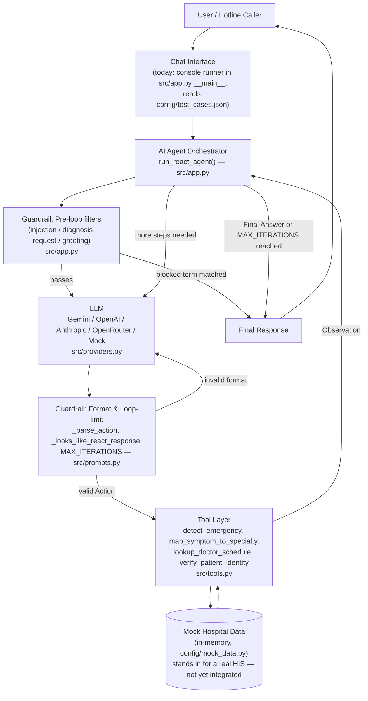
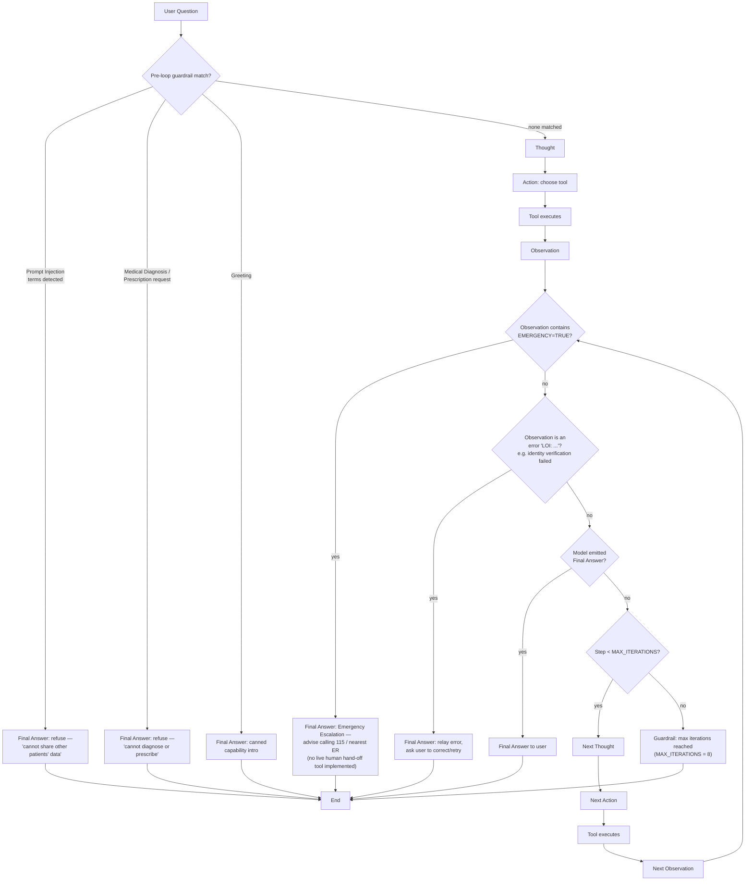
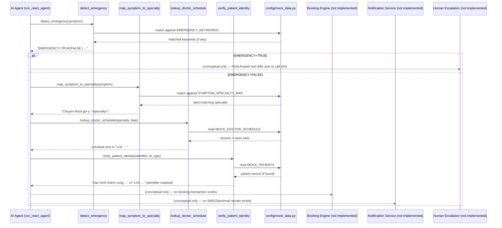

# 🏗️ System Architecture — AI Hospital Appointment & Medical Specialty Consultation Agent

This document analyzes the architecture of the code actually present in this repository (`src/`, `config/`, `docs/`). It is grounded strictly in what is implemented — sections that describe target/future behavior (e.g. a real booking transaction, SMS notifications, live human hand-off) are explicitly marked **not implemented**, since the current codebase is a lab/demo ReAct agent, not a production hospital system.

---

## 1. Product Goal

Give a hotline caller who describes symptoms in free-form natural language (Vietnamese) a safe, tool-grounded path to:

1. Be screened for emergency warning signs first, before anything else.
2. Get routed to the correct hospital specialty (`Khoa`) based on the symptom description.
3. See real doctor names and open time slots for that specialty/date.
4. Have their identity checked against a patient record before any appointment is finalized.

The project's secondary goal (visible in `README.md`'s lab framing) is pedagogical: to demonstrate, side by side, why a plain LLM chatbot (Level 2) is insufficient for this problem and a ReAct agent (Level 3) is required.

## 2. Main Features (as implemented)

| Feature | Where |
|---|---|
| Emergency keyword screening | `detect_emergency` in `src/tools.py` |
| Symptom → specialty routing | `map_symptom_to_specialty` in `src/tools.py` |
| Doctor/slot lookup by specialty + date | `lookup_doctor_schedule` in `src/tools.py` |
| Patient identity check (phone/CCCD/BHYT) | `verify_patient_identity` in `src/tools.py` |
| ReAct Thought→Action→Observation loop | `run_react_agent` in `src/app.py` |
| Baseline (tool-less) chatbot for comparison | `run_baseline_chatbot` in `src/app.py` |
| Pre-loop guardrails (injection, diagnosis request, greeting) | `run_react_agent` in `src/app.py` |
| Loop-limit guardrail (`MAX_ITERATIONS`) | `src/prompts.py` + `src/app.py` |
| Multi-provider LLM adapter (Gemini/OpenAI/Anthropic/OpenRouter/Mock) | `src/providers.py` |
| Offline deterministic simulation of the ReAct trace | `_build_fallback_step` in `src/app.py`, used automatically by `MockProvider` |

**Not implemented** (do not exist as code, only as text the agent produces or as target behavior described in `config/test_cases.json`): an actual booking/reservation transaction, an SMS/Zalo/email notification sender, a live human-agent hand-off channel, a real Hospital Information System integration, cancellation/reschedule logic, and multi-patient (book-for-family-member) identity linking. Where the agent currently says "please provide your phone/CCCD/BHYT to confirm" or "call 115", that is the end of the automated flow — no downstream system is actually called.

## 3. User Journey (current implementation)

The only entry point today is `src/app.py`'s `__main__` block, which loads `config/test_cases.json` and runs each question through both `run_baseline_chatbot` and `run_react_agent`, printing the trace to the console. There is no web/API/chat-widget front end yet — "Chat Interface" in the diagrams below stands for this console runner (or, conceptually, whatever channel the hotline would use in production).

1. A question string enters `run_react_agent`.
2. It is normalized and checked against three hardcoded guardrail term lists (injection, diagnosis/prescription request, greeting). A match short-circuits immediately with a canned `Final Answer` — no LLM or tool call happens.
3. Otherwise the ReAct loop begins (see §9 and Diagram 2).
4. `detect_emergency` is always the first tool called when there are no prior observations.
5. If not an emergency, the agent maps symptom → specialty, looks up schedule, and asks the user to pick a slot and supply an identifier.
6. `verify_patient_identity` checks the format and looks the identifier up in `MOCK_PATIENTS`.
7. The loop ends with a `Final Answer` (or, after `MAX_ITERATIONS` = 8 steps, with a printed guardrail message) — nothing is persisted or booked.

## 4. AI Agent Responsibilities

The "agent" is the orchestration logic in `run_react_agent` (`src/app.py`), not the LLM itself:

- Runs the guardrail pre-filters before allowing any reasoning to happen.
- Drives the Thought→Action→Observation loop for up to `MAX_ITERATIONS` steps.
- Parses the model's `Action: tool_name[args]` line with a strict regex (`_parse_action`) and rejects anything that doesn't match.
- Validates that a real provider's output actually looks like a ReAct step (`_looks_like_react_response`); if not, it discards the LLM output and substitutes a deterministic step from `_build_fallback_step`, so a malformed generation can never break the loop.
- Dispatches the parsed tool call to `AVAILABLE_TOOLS` and feeds the returned string back as the next `Observation`.
- Terminates the loop as soon as `Final Answer:` appears, or after the iteration cap is hit.

## 5. LLM Responsibilities

When a real provider (Gemini/OpenAI/Anthropic/OpenRouter) is configured via `LLM_PROVIDER` in `.env`:

- Read the `REACT_SYSTEM_PROMPT` (`src/prompts.py`), which enumerates the 4 available tools, their call syntax, and the mandatory rules (call `detect_emergency` first, never fabricate a schedule, never diagnose/prescribe, escalate on `EMERGENCY=TRUE`, restrict `id_type` to `phone|cccd|bhyt`).
- On each turn, produce **exactly one** `Thought` + `Action` pair, or a `Thought` + `Final Answer` pair — never both, never an invented `Observation`.
- Decide, from the accumulated observations, what the single next step should be (which tool, which arguments, or whether enough evidence exists to answer).

When `LLM_PROVIDER=mock` (the default, and what actually runs `config/test_cases.json` offline), the LLM is replaced entirely by `MockProvider`, and every "reasoning" step instead comes from the deterministic `_build_fallback_step` function — this guarantees the lab's test cases are reproducible without any API key.

## 6. Tool Responsibilities

See the full table in §7 of `README.md`. In short, each tool in `src/tools.py` is a pure function that validates its own arguments, looks up static data from `config/mock_data.py`, and returns a plain string — either a `LOI: ...` (error) message or a result description. Tools never call each other and never touch the LLM.

## 7. Guardrail Responsibilities

Guardrails exist at three separate layers, and none of them depend on the LLM to police itself:

1. **Pre-loop hard blocks** (`run_react_agent`, before the loop even starts): substring lists for prompt-injection / other-patient-data requests, medical diagnosis/prescription requests, and greetings. These fire regardless of which LLM provider is configured.
2. **In-loop deterministic behavior**: `detect_emergency` is always the first action when there are no observations yet; an `EMERGENCY=TRUE` observation always ends the loop with an escalation message instead of continuing to specialty routing.
3. **Structural/format guardrails**: `_parse_action`'s regex rejects anything not shaped like `Action: tool_name[args]`; `_looks_like_react_response` rejects free-text LLM replies that skip the required labels and replaces them with a deterministic fallback step; `MAX_ITERATIONS = 8` caps the loop and prints an explicit guardrail message if exhausted.
4. **Data-privacy guardrail**: `_mask_identifier` in `src/tools.py` masks all but the last 4 characters of any phone/CCCD/BHYT number before it is echoed back in an `Observation`.

## 8. External Systems

Today there are **no external systems** wired in beyond the LLM provider APIs themselves:

- `config/mock_data.py` is an in-memory, static stand-in for a real Hospital Information System (doctor directory, schedule, patient roster, symptom/emergency keyword tables). It is loaded as a plain Python import — there is no database, no network call, no persistence.
- `src/providers.py` calls out to Gemini / OpenAI / Anthropic / OpenRouter HTTP APIs (or none, in Mock mode).
- There is no notification gateway (SMS/Zalo/email), no real booking database, and no telephony/hotline integration.

## 9. Data Flow & Request Lifecycle

```
question string
  → _normalize / _plain (src/app.py)
  → pre-loop guardrail term match?  → yes → Final Answer (refusal/redirect) → END
  → no
  → loop (1..MAX_ITERATIONS):
       provider.generate(REACT_SYSTEM_PROMPT, history)   [or _build_fallback_step if MockProvider / malformed output]
       → "Final Answer:" present?  → yes → print → END
       → _parse_action → (tool_name, args)
       → no tool_name parsed → Final Answer (generic failure) → END
       → AVAILABLE_TOOLS[tool_name](*args)  [tools.py reads config/mock_data.py]
       → Observation string appended to history, loop continues
  → loop exhausted without Final Answer → print "Guardrail: đã đạt giới hạn tối đa N bước" → END
```

## 10. Why This Project Uses a ReAct Agent Architecture

`docs/trace_eval.md` scores the problem 17/20 on the Agentic Fit matrix, and the code backs that up structurally:

- **Multi-step reasoning is mandatory, not optional.** A correct answer requires chaining emergency screening → specialty mapping → schedule lookup → identity verification, where each step's *input* depends on the *previous step's Observation*. A single LLM completion cannot do this because it has no way to look up real doctor names, real slots, or a real patient record — it can only guess, and guessing about medical routing/scheduling is the exact failure mode this project guards against (see `map_symptom_to_specialty`'s and `lookup_doctor_schedule`'s explicit "day chi la goi y, khong thay the chan doan bac si" / "khong duoc tu bia lich" language and the system prompt's "Không được tự bịa lịch nếu chưa gọi tool này").
- **Tool grounding is a safety requirement, not a convenience.** Because the domain is healthcare, hallucinated schedules or a missed emergency signal have real-world consequences. A ReAct loop forces every factual claim (specialty, schedule, identity) to originate from a deterministic tool call whose output the orchestrator — not the LLM — appends to the transcript.
- **The branching is dynamic and content-dependent.** Whether the very next action is "ask for more detail", "call `lookup_doctor_schedule`", or "escalate to 115" depends entirely on the text of the previous `Observation` — this is exactly the `Thought → Action → Observation → Thought → ...` pattern ReAct was designed for, and is why the baseline chatbot (`run_baseline_chatbot`, no tools) is kept in the codebase side by side as a deliberate negative example.
- **Guardrails need a place to intercept.** A single-shot chatbot completion has no intermediate point to insert a hard rule; a loop with discrete steps gives the orchestrator a place to check each `Observation` for `EMERGENCY=TRUE`, cap iterations, and validate the output format before it's ever shown to the user.

---

## Diagram 1 — Overall System Architecture



---

## Diagram 2 — ReAct Execution Flow



---

## Diagram 3 — Tool Interaction Diagram


