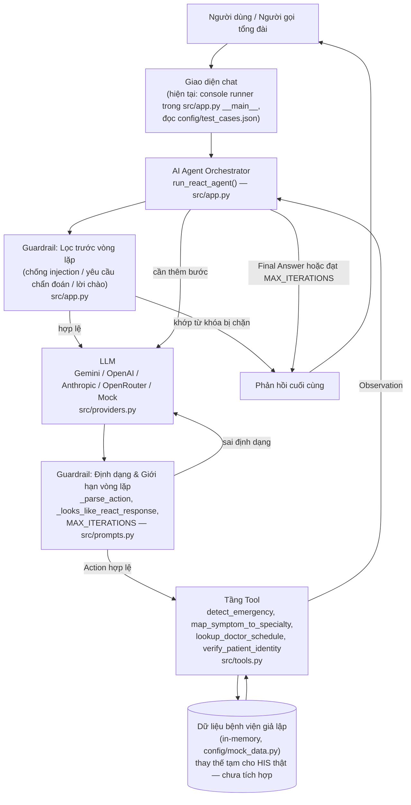
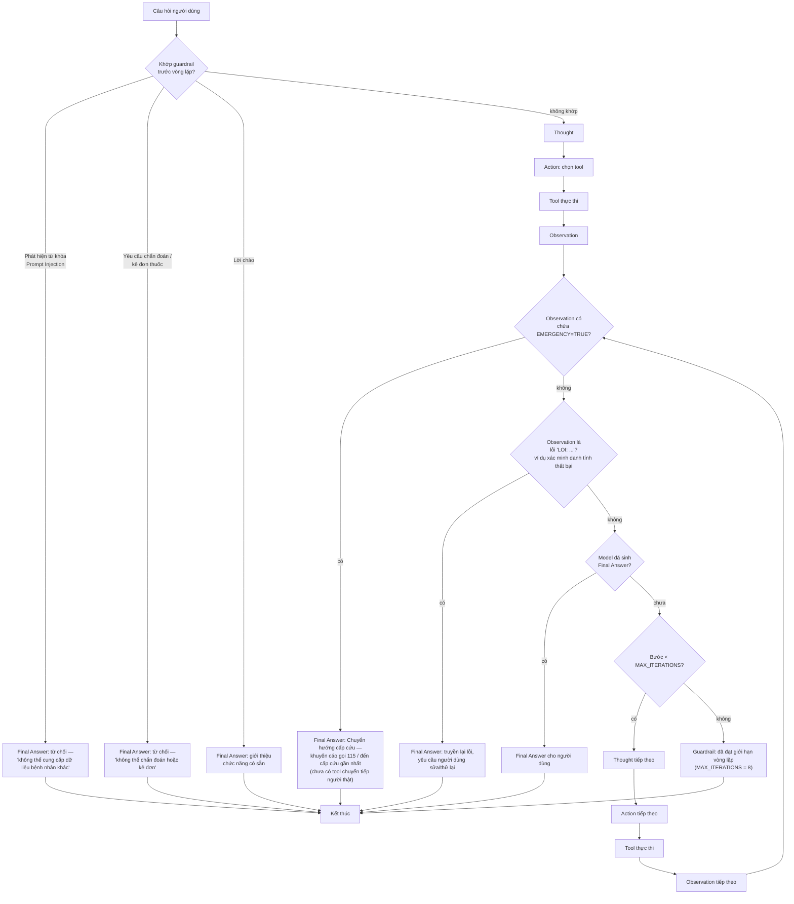
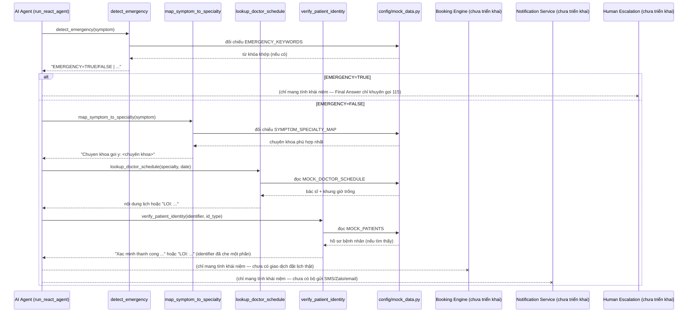

# 🏗️ Kiến Trúc Hệ Thống — AI Agent Tư Vấn Chuyên Khoa & Đặt Lịch Khám Bệnh

Tài liệu này phân tích kiến trúc dựa trên code thực tế đang có trong repo (`src/`, `config/`, `docs/`). Nội dung bám sát nghiêm ngặt những gì đã được cài đặt — các phần mô tả hành vi mục tiêu/tương lai (ví dụ: giao dịch đặt lịch thật, gửi SMS, chuyển tiếp người thật trực tiếp) đều được ghi chú rõ là **chưa triển khai**, vì codebase hiện tại là một ReAct agent phục vụ bài lab/demo, không phải hệ thống bệnh viện sản xuất thật.

---

## 1. Mục tiêu sản phẩm (Product Goal)

Đưa người gọi tổng đài mô tả triệu chứng bằng ngôn ngữ tự nhiên (tiếng Việt) đi theo một lộ trình an toàn, có căn cứ từ tool:

1. Được sàng lọc dấu hiệu cấp cứu trước tiên, trước bất kỳ điều gì khác.
2. Được định tuyến đến đúng chuyên khoa bệnh viện (`Khoa`) dựa trên mô tả triệu chứng.
3. Thấy được tên bác sĩ thật và khung giờ trống cho chuyên khoa/ngày đó.
4. Được đối chiếu danh tính với hồ sơ bệnh nhân trước khi bất kỳ lịch hẹn nào được chốt.

Mục tiêu phụ của dự án (thể hiện qua cách trình bày bài lab trong `README.md`) mang tính sư phạm: minh họa song song vì sao một chatbot LLM thuần túy (Cấp 2) không đủ để giải quyết bài toán này và cần đến một ReAct agent (Cấp 3).

## 2. Tính năng chính (theo những gì đã cài đặt)

| Tính năng | Nằm ở đâu |
|---|---|
| Sàng lọc từ khóa cấp cứu | `detect_emergency` trong `src/tools.py` |
| Định tuyến triệu chứng → chuyên khoa | `map_symptom_to_specialty` trong `src/tools.py` |
| Tra cứu bác sĩ/khung giờ theo chuyên khoa + ngày | `lookup_doctor_schedule` trong `src/tools.py` |
| Kiểm tra danh tính bệnh nhân (phone/CCCD/BHYT) | `verify_patient_identity` trong `src/tools.py` |
| Vòng lặp ReAct Thought→Action→Observation | `run_react_agent` trong `src/app.py` |
| Chatbot nền (không tool) để so sánh | `run_baseline_chatbot` trong `src/app.py` |
| Guardrail trước vòng lặp (chống injection, yêu cầu chẩn đoán, lời chào) | `run_react_agent` trong `src/app.py` |
| Guardrail giới hạn vòng lặp (`MAX_ITERATIONS`) | `src/prompts.py` + `src/app.py` |
| Adapter LLM đa nhà cung cấp (Gemini/OpenAI/Anthropic/OpenRouter/Mock) | `src/providers.py` |
| Mô phỏng offline xác định cho trace ReAct | `_build_fallback_step` trong `src/app.py`, được `MockProvider` tự động sử dụng |

## 3. Hành trình người dùng (theo cài đặt hiện tại)

Điểm vào duy nhất hiện nay là khối `__main__` của `src/app.py`, nơi nạp `config/test_cases.json` và chạy từng câu hỏi qua cả `run_baseline_chatbot` lẫn `run_react_agent`, in trace ra console. Chưa có giao diện web/API/chat-widget nào — "Giao diện chat" trong các sơ đồ bên dưới đại diện cho console runner này (hoặc, về mặt khái niệm, bất kỳ kênh nào tổng đài sẽ dùng trong thực tế).

1. Một chuỗi câu hỏi đi vào `run_react_agent`.
2. Câu hỏi được chuẩn hóa và đối chiếu với ba danh sách từ khóa guardrail cứng (injection, yêu cầu chẩn đoán/kê đơn, lời chào). Nếu khớp, luồng ngắt ngay lập tức với một `Final Answer` dựng sẵn — không có lệnh gọi LLM hay tool nào.
3. Nếu không, vòng lặp ReAct bắt đầu (xem mục 9 và Sơ đồ 2).
4. `detect_emergency` luôn là tool được gọi đầu tiên khi chưa có observation nào trước đó.
5. Nếu không phải cấp cứu, agent ánh xạ triệu chứng → chuyên khoa, tra lịch, và yêu cầu người dùng chọn khung giờ cùng cung cấp một identifier.
6. `verify_patient_identity` kiểm tra định dạng và tra cứu identifier trong `MOCK_PATIENTS`.
7. Vòng lặp kết thúc bằng một `Final Answer` (hoặc, sau `MAX_ITERATIONS` = 8 bước, bằng một thông báo guardrail được in ra) — không có gì được lưu trữ hay đặt lịch thật.

## 4. Trách nhiệm của AI Agent

- Chạy các bộ lọc guardrail trước khi cho phép bất kỳ suy luận nào diễn ra.
- Điều khiển vòng lặp Thought→Action→Observation tối đa `MAX_ITERATIONS` bước.
- Phân tích dòng `Action: tool_name[args]` của model bằng regex nghiêm ngặt (`_parse_action`) và từ chối bất cứ thứ gì không khớp.
- Kiểm tra xem output của một provider thật có thực sự giống một bước ReAct hợp lệ hay không (`_looks_like_react_response`); nếu không, bỏ output của LLM và thay bằng một bước xác định từ `_build_fallback_step`, để một lượt sinh sai định dạng không bao giờ làm hỏng vòng lặp.
- Điều phối lệnh gọi tool đã phân tích đến `AVAILABLE_TOOLS` và đưa chuỗi trả về làm `Observation` tiếp theo.
- Kết thúc vòng lặp ngay khi xuất hiện `Final Answer:`, hoặc sau khi đạt giới hạn số vòng lặp.

---

## Sơ đồ 1 — Kiến trúc hệ thống tổng thể

---

## Sơ đồ 2 — Luồng thực thi ReAct

---

## Sơ đồ 3 — Sơ đồ tương tác với Tool

